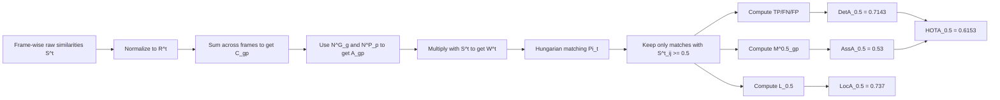

# Worked HOTA Example — 4 Frames, 3 GT Tracks, 4 Predicted Tracks

Below numeric walk-through below uses a **single threshold**

\[
\alpha = 0.5
\]

while the real HOTA code repeats the thresholded part for all

\[
\alpha \in \{0.05, 0.10, \ldots, 0.95\}.
\]

---

## 1. Track presence across 4 frames

### GT tracks

| GT track | Frame 1 | Frame 2 | Frame 3 | Frame 4 | Total detections |
|---|---:|---:|---:|---:|---:|
| \(G_1\) | ✓ | ✓ | ✓ | ✓ | 4 |
| \(G_2\) | ✓ | ✓ | – | ✓ | 3 |
| \(G_3\) | ✓ | ✓ | ✓ | ✓ | 4 |

So:

\[
N^G_{G_1}=4,\qquad N^G_{G_2}=3,\qquad N^G_{G_3}=4.
\]

### Predicted tracks

| Pred track | Frame 1 | Frame 2 | Frame 3 | Frame 4 | Total detections |
|---|---:|---:|---:|---:|---:|
| \(P_1\) | ✓ | ✓ | ✓ | ✓ | 4 |
| \(P_2\) | ✓ | ✓ | ✓ | ✓ | 4 |
| \(P_3\) | ✓ | – | ✓ | ✓ | 3 |
| \(P_4\) | – | ✓ | – | ✓ | 2 |

So:

\[
N^P_{P_1}=4,\quad N^P_{P_2}=4,\quad N^P_{P_3}=3,\quad N^P_{P_4}=2.
\]

---

## 2. Per-frame similarity matrices \(S^t\)
## Per-frame Raw and Normalized Similarity Matrices

For each frame, the raw similarity matrix \(S^t\) is converted into the normalized similarity matrix \(R^t\) using

\[
R^t_{ij}
=
\frac{
S^t_{ij}
}{
\sum_j S^t_{ij}
+
\sum_i S^t_{ij}
-
S^t_{ij}
}.
\]

The row labels correspond to GT tracks and the column labels correspond to predicted tracks.

---

### Frame 1

\[
S^1 =
\begin{array}{c|ccc}
 & P_1 & P_2 & P_3 \\ \hline
G_1 & 0.90 & 0.60 & 0.00 \\
G_2 & 0.20 & 0.55 & 0.00 \\
G_3 & 0.00 & 0.30 & 0.85
\end{array}
\quad
\xrightarrow{\text{row/column normalization}}
\quad
R^1 =
\begin{array}{c|ccc}
 & P_1 & P_2 & P_3 \\ \hline
G_1 & 0.52 & 0.25 & 0.00 \\
G_2 & 0.12 & 0.33 & 0.00 \\
G_3 & 0.00 & 0.13 & 0.73
\end{array}
\]

For example,

\[
R^1_{G_1,P_1}
=
\frac{0.90}{1.50+1.10-0.90}
=
\frac{0.90}{1.70}
=
0.5294
\]

whereas

\[
R^1_{G_1,P_2}
=
\frac{0.60}{1.50+1.45-0.60}
=
\frac{0.60}{2.35}
=
0.2553.
\]

Although \(S^1_{G_1,P_2}=0.60\) is reasonably high, the normalized score is reduced because \(P_2\) has significant similarity with multiple GT objects.

In contrast,

\[
R^1_{G_3,P_3}
=
\frac{0.85}{1.15+0.85-0.85}
=
\frac{0.85}{1.15}
=
0.7391,
\]

showing that \((G_3,P_3)\) is a strong and relatively unambiguous correspondence.

---

### Frame 2

\[
S^2 =
\begin{array}{c|ccc}
 & P_1 & P_2 & P_4 \\ \hline
G_1 & 0.88 & 0.52 & 0.00 \\
G_2 & 0.10 & 0.58 & 0.45 \\
G_3 & 0.00 & 0.35 & 0.50
\end{array}
\quad
\xrightarrow{\text{row/column normalization}}
\quad
R^2 =
\begin{array}{c|ccc}
 & P_1 & P_2 & P_4 \\ \hline
G_1 & 0.58 & 0.22 & 0.00 \\
G_2 & 0.04 & 0.29 & 0.27 \\
G_3 & 0.00 & 0.17 & 0.38
\end{array}
\]

Here, \(P_2\) overlaps with all three GT objects, so its normalized similarities are reduced. The \(G_1 \leftrightarrow P_1\) correspondence remains comparatively strong and clean.

---

### Frame 3

\[
S^3 =
\begin{array}{c|ccc}
 & P_1 & P_2 & P_3 \\ \hline
G_1 & 0.40 & 0.72 & 0.00 \\
G_3 & 0.00 & 0.40 & 0.83
\end{array}
\quad
\xrightarrow{\text{row/column normalization}}
\quad
R^3 =
\begin{array}{c|ccc}
 & P_1 & P_2 & P_3 \\ \hline
G_1 & 0.35 & 0.47 & 0.00 \\
G_3 & 0.00 & 0.20 & 0.67
\end{array}
\]

Although \(G_1\) has similarity with both \(P_1\) and \(P_2\), normalization favors \(P_2\). For \(G_3\), the \(P_3\) correspondence is substantially cleaner than \(P_2\).

---

### Frame 4

\[
S^4 =
\begin{array}{c|cccc}
 & P_1 & P_2 & P_3 & P_4 \\ \hline
G_1 & 0.86 & 0.50 & 0.00 & 0.00 \\
G_2 & 0.00 & 0.48 & 0.00 & 0.62 \\
G_3 & 0.00 & 0.20 & 0.80 & 0.42
\end{array}
\quad
\xrightarrow{\text{row/column normalization}}
\quad
R^4 =
\begin{array}{c|cccc}
 & P_1 & P_2 & P_3 & P_4 \\ \hline
G_1 & 0.63 & 0.24 & 0.00 & 0.00 \\
G_2 & 0.00 & 0.26 & 0.00 & 0.40 \\
G_3 & 0.00 & 0.08 & 0.56 & 0.20
\end{array}
\]

The normalization again suppresses ambiguous predictions such as \(P_2\), while relatively isolated correspondences such as \(G_1 \leftrightarrow P_1\) and \(G_3 \leftrightarrow P_3\) retain higher normalized scores.

---

Overall, the transformation

\[
S^t
\quad
\xrightarrow{\text{row/column normalization}}
\quad
R^t
\]

rewards **strong, unambiguous GT-prediction correspondences** while penalizing similarities that compete with several alternatives.

---

## 3. Accumulate global identity evidence \(C_{gp}\)

\[
C_{gp}
=
\sum_{t,i,j:
ID_G(i)=g,\;ID_P(j)=p}
R^t_{ij}
\]

Non-zero values:

\[
C_{G_1,P_1}=2.10,\quad
C_{G_1,P_2}=1.19
\]

\[
C_{G_2,P_1}=0.17,\quad
C_{G_2,P_2}=0.89,\quad
C_{G_2,P_4}=0.68
\]

\[
C_{G_3,P_2}=0.59,\quad
C_{G_3,P_3}=1.97,\quad
C_{G_3,P_4}=0.59
\]

| \(C_{gp}\) | \(P_1\) | \(P_2\) | \(P_3\) | \(P_4\) |
|---|---:|---:|---:|---:|
| \(G_1\) | 2.10 | 1.19 | 0 | 0 |
| \(G_2\) | 0.17 | 0.89 | 0 | 0.68 |
| \(G_3\) | 0 | 0.59 | 1.97 | 0.59 |

---

## 4. Global identity alignment \(A_{gp}\)

\[
A_{gp}
=
\frac{
C_{gp}
}{
N^G_g + N^P_p - C_{gp}
}
\]

Examples:

\[
A_{G_1,P_1}
=
\frac{2.10}{4+4-2.10}
=
0.35
\]

\[
A_{G_1,P_2}
=
\frac{1.19}{4+4-1.19}
=
0.17
\]

\[
A_{G_3,P_3}
=
\frac{1.97}{4+3-1.97}
=
0.39
\]

Global alignment matrix:

| \(A_{gp}\) | \(P_1\) | \(P_2\) | \(P_3\) | \(P_4\) |
|---|---:|---:|---:|---:|
| \(G_1\) | 0.35 | 0.17 | 0 | 0 |
| \(G_2\) | 0.02 | 0.14 | 0 | 0.15 |
| \(G_3\) | 0 | 0.08 | 0.39 | 0.10 |

---

## 5. Frame-level matching-score matrices \(W^t\)

\[
W^t_{ij}
=
A_{ID_G(i),ID_P(j)}\cdot S^t_{ij}
\]

### Frame 1

\[
W^1 =
\begin{bmatrix}
0.32 & 0.10 & 0.00 \\
0.00 & 0.08 & 0.00 \\
0.00 & 0.02 & 0.33
\end{bmatrix}
\]

Hungarian:

\[
\Pi_1=\{(G_1,P_1),(G_2,P_2),(G_3,P_3)\}
\]

Since all selected pairs have \(S \ge 0.5\):

\[
\Pi_1^{0.5}=\Pi_1
\]

### Frame 2

\[
W^2 =
\begin{bmatrix}
0.31 & 0.09 & 0.00 \\
0.00 & 0.08 & 0.07 \\
0.00 & 0.02 & 0.05
\end{bmatrix}
\]

(Columns correspond to \(P_1,P_2,P_4\).)

Hungarian:

\[
\Pi_2=\{(G_1,P_1),(G_2,P_2),(G_3,P_4)\}
\]

Again all selected pairs satisfy \(S \ge 0.5\), so:

\[
\Pi_2^{0.5}=\Pi_2
\]

### Frame 3

\[
W^3 =
\begin{bmatrix}
0.14 & 0.13 & 0.00 \\
0.00 & 0.03 & 0.33
\end{bmatrix}
\]

(Columns correspond to \(P_1,P_2,P_3\).)

Hungarian:

\[
\Pi_3=\{(G_1,P_1),(G_3,P_3)\}
\]

Thresholding with \(\alpha=0.5\):

- \((G_1,P_1)\): raw similarity \(0.40 < 0.5\) → reject
- \((G_3,P_3)\): raw similarity \(0.83 \ge 0.5\) → accept

So:

\[
\Pi_3^{0.5}=\{(G_3,P_3)\}
\]

> Even though \(S^3_{G_1,P_2}=0.72\) is larger than \(S^3_{G_1,P_1}=0.40\),
> the global alignment makes \((G_1,P_1)\) score slightly higher in \(W^3\).

### Frame 4

\[
W^4 =
\begin{bmatrix}
0.31 & 0.09 & 0.00 & 0.00 \\
0.00 & 0.07 & 0.00 & 0.10 \\
0.00 & 0.02 & 0.31 & 0.05
\end{bmatrix}
\]

Hungarian:

\[
\Pi_4=\{(G_1,P_1),(G_2,P_4),(G_3,P_3)\}
\]

All chosen pairs satisfy \(S \ge 0.5\), hence:

\[
\Pi_4^{0.5}=\Pi_4
\]

---

## 6. Summary of matches

| Frame | Hungarian \(\Pi_t\) | Accepted \(\Pi_t^{0.5}\) |
|---|---|---|
| 1 | \((G_1,P_1),(G_2,P_2),(G_3,P_3)\) | same |
| 2 | \((G_1,P_1),(G_2,P_2),(G_3,P_4)\) | same |
| 3 | \((G_1,P_1),(G_3,P_3)\) | \((G_3,P_3)\) only |
| 4 | \((G_1,P_1),(G_2,P_4),(G_3,P_3)\) | same |

---

## 7. Detection counts at \(\alpha=0.5\)

Per frame:

- Frame 1: \(TP=3,\ FN=0,\ FP=0\)
- Frame 2: \(TP=3,\ FN=0,\ FP=0\)
- Frame 3: \(TP=1,\ FN=1,\ FP=2\)
- Frame 4: \(TP=3,\ FN=0,\ FP=1\)

Overall:

\[
TP_{0.5}=10,\qquad FN_{0.5}=1,\qquad FP_{0.5}=3
\]

---

## 8. Identity-pair match counts \(M^{0.5}_{gp}\)

Accepted identity-pair counts:

\[
M^{0.5}_{G_1,P_1}=3
\]

\[
M^{0.5}_{G_2,P_2}=2,\qquad M^{0.5}_{G_2,P_4}=1
\]

\[
M^{0.5}_{G_3,P_3}=3,\qquad M^{0.5}_{G_3,P_4}=1
\]

Distributed match-count matrix:

| \(M^{0.5}_{gp}\) | \(P_1\) | \(P_2\) | \(P_3\) | \(P_4\) |
|---|---:|---:|---:|---:|
| \(G_1\) | 3 | 0 | 0 | 0 |
| \(G_2\) | 0 | 2 | 0 | 1 |
| \(G_3\) | 0 | 0 | 3 | 1 |

---

## 9. Association IoU per identity pair

\[
AssIoU^\alpha_{gp}
=
\frac{
M^\alpha_{gp}
}{
N^G_g + N^P_p - M^\alpha_{gp}
}
\]

At \(\alpha=0.5\):

\[
AssIoU^{0.5}_{G_1,P_1}
=
\frac{3}{4+4-3}
=
0.60
\]

\[
AssIoU^{0.5}_{G_2,P_2}
=
\frac{2}{3+4-2}
=
0.40
\]

\[
AssIoU^{0.5}_{G_2,P_4}
=
\frac{1}{3+2-1}
=
0.25
\]

\[
AssIoU^{0.5}_{G_3,P_3}
=
\frac{3}{4+3-3}
=
0.75
\]

\[
AssIoU^{0.5}_{G_3,P_4}
=
\frac{1}{4+2-1}
=
0.20
\]

Distributed match-count matrix:

| \(AssIoU^{0.5}_{gp}\) | \(P_1\) | \(P_2\) | \(P_3\) | \(P_4\) |
|---|---:|---:|---:|---:|
| \(G_1\) | 0.6 | 0 | 0 | 0 |
| \(G_2\) | 0 | 0.4 | 0 | 0.25 |
| \(G_3\) | 0 | 0 | 0.75 | 0.20 |

---

## 10. Association Accuracy \(AssA_{0.5}\)

\[
AssA_{0.5}
=
\frac{
\sum_{g,p}
M^{0.5}_{gp}\,AssIoU^{0.5}_{gp}
}{
TP_{0.5}
}
\]

\[
AssA_{0.5}
=
\frac{
3(0.60)+2(0.40)+1(0.25)+3(0.75)+1(0.20)
}{
10
}
\]

\[
AssA_{0.5}
=
\frac{
1.80+0.80+0.25+2.25+0.20
}{
10
}
=
\frac{5.30}{10}
=
0.53
\]

---

## 11. Localization Accuracy \(LocA_{0.5}\)

Accepted-similarity sum:

- Frame 1: \(0.90+0.55+0.85=2.30\)
- Frame 2: \(0.88+0.58+0.50=1.96\)
- Frame 3: \(0.83\)
- Frame 4: \(0.86+0.62+0.80=2.28\)

Therefore:

\[
L_{0.5}=2.30+1.96+0.83+2.28=7.37
\]

\[
LocA_{0.5}
=
\frac{L_{0.5}}{TP_{0.5}}
=
\frac{7.37}{10}
=
0.737
\]

---

## 12. Detection metrics

\[
DetRe_{0.5}
=
\frac{10}{10+1}
=
0.9091
\]

\[
DetPr_{0.5}
=
\frac{10}{10+3}
=
0.7692
\]

\[
DetA_{0.5}
=
\frac{10}{10+1+3}
=
\frac{10}{14}
=
0.7143
\]

---

## 13. Final HOTA at \(\alpha=0.5\)

\[
HOTA_{0.5}
=
\sqrt{
DetA_{0.5}\cdot AssA_{0.5}
}
=
\sqrt{
0.7143 \cdot 0.53
}
=
0.6153
\]

---

## 14. Compact “calculation flow” summary

---

## 15. Key takeaways

1. **Normalization matters**  
   Ambiguous row/column overlap reduces normalized contribution.

2. **Global alignment matters**  
   Matching is based on \(W^t = A \odot S^t\), not just raw similarity.

3. **`matches_count` is distributed**  
   Here \(M^{0.5}_{gp}\) is not a perfect diagonal.

4. **Association and detection both affect HOTA**  
   Imperfect track consistency reduces \(AssA\), which reduces final HOTA.

